# RGB-Data-Collection
Get data from "Intel Realsense D435i", "Zed2", "PMD pico monstar" and using Relay.

</img>

## SDK

### Intel RealSense D435i (Active IR Stereo Camera)

The python wrapper for Intel RealSense SDK 2.0 provides the C++ to Python binding required to access the SDK.

The easiest way to install this library is using pip:
```
pip install pyrealsense2
```

### Zed2 (Stereo Camerea)

To start using the ZED SDK in Python, you should refer to this site:

https://www.stereolabs.com/docs/app-development/python/install/


### PMD pico monstar (ToF Camera)

To start using the Royale SDK, you should refer to this site:

https://pmdtec.com/picofamily/software/

## About USB relay

</img>

please check below site about a USB relay

https://github.com/Jstar0525/RGBD-Data-Collection/tree/master/usb_relay

## Data

dataset is collected in **data** folder

### intel realsense D435i

**realsense** collects dataset like this:

* ir_on : IR projector turn on and get gray stereo images and depth
* rgb : IR projector turn on and get rgb image and depth align with rgb
* ir_off : IR projector turn off and get gray stereo images and depth

#### data/realsense/ir_on
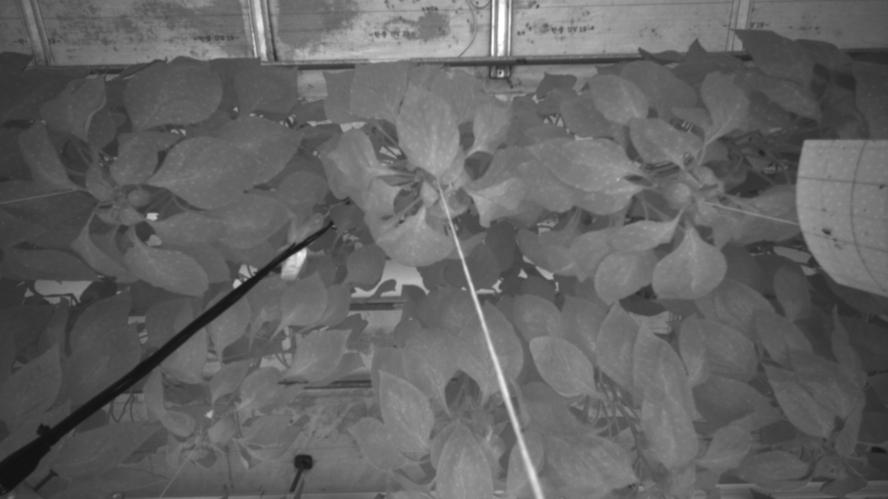</img> 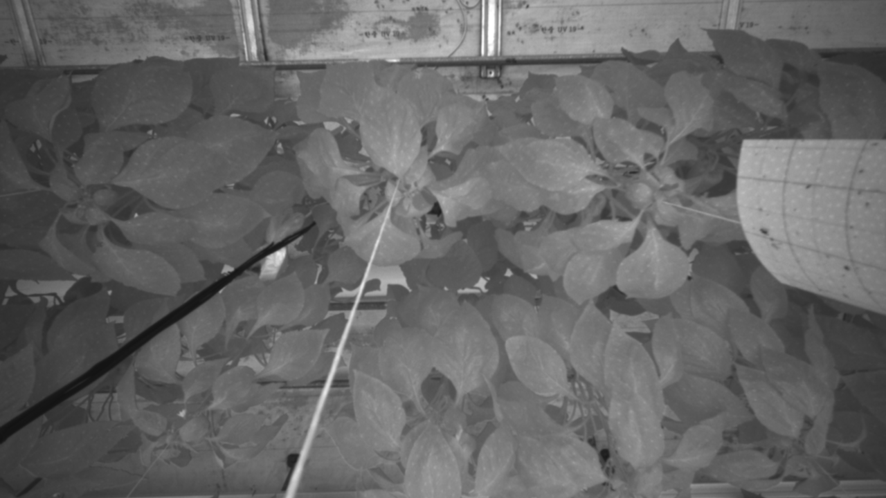</img> 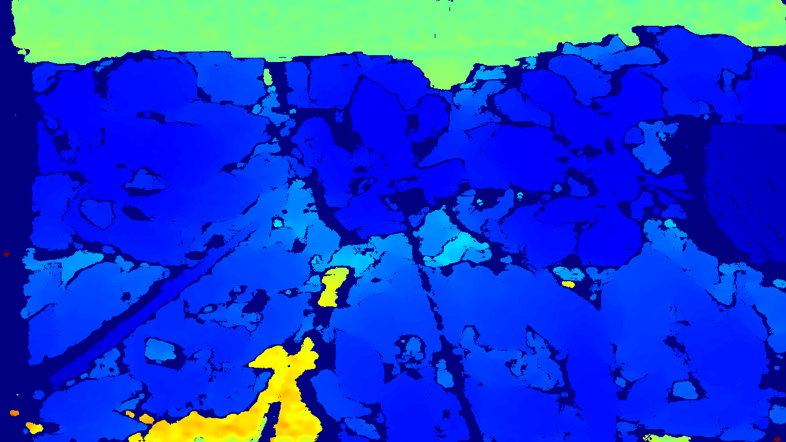</img>

#### data/realsense/rgb
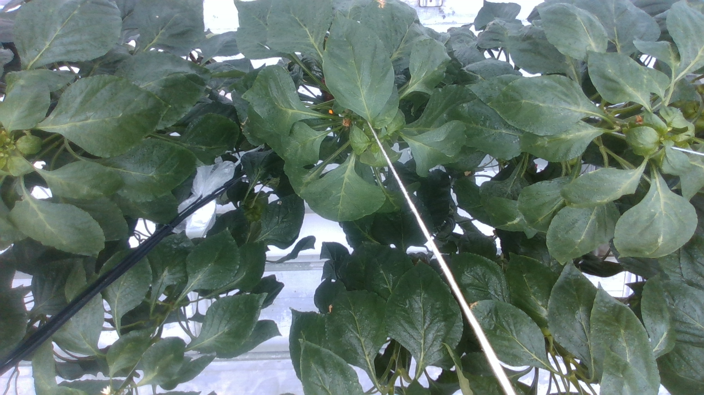 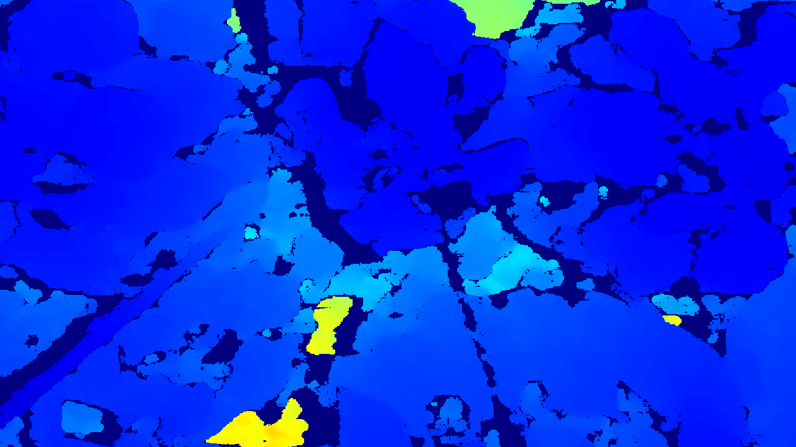

#### data/realsense/ir_off
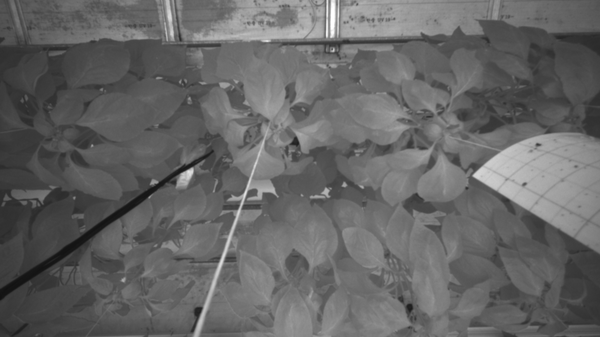</img> </img> 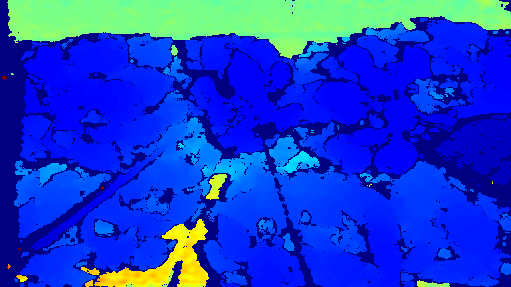</img>

### Zed2

**Zed2** collects dataset like this:

* get rgb stereo images, depth, disparity and confidence

### data/zed
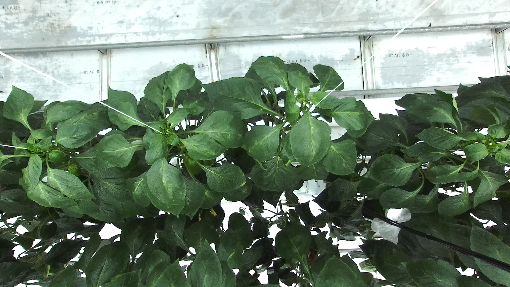</img> 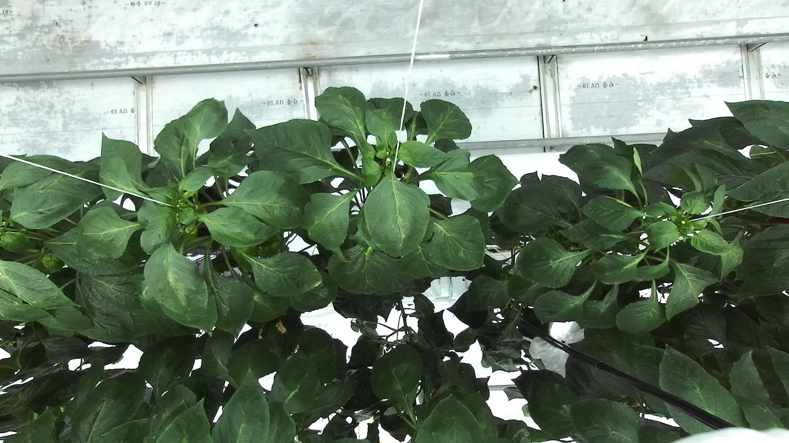</img> 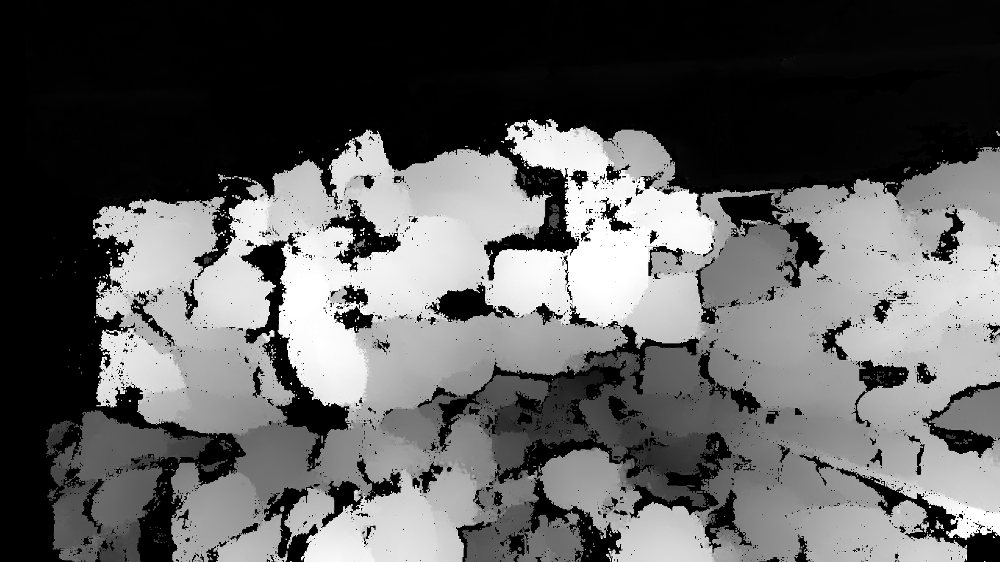</img>

### PMD pico monstar

**PMD pico monstar** collects dataset like this:

* distort : get origimal gray image and depth
* undistort : get distortion correction gray image and depth

#### data/pico/distort
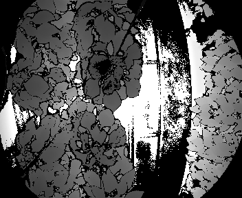</img> 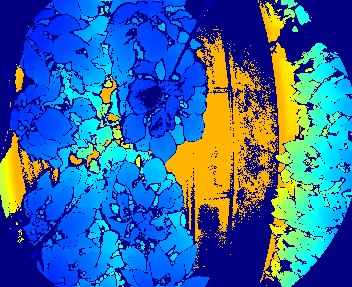</img>

#### data/pico/undistort
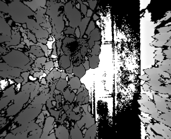</img> 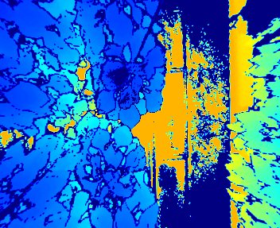</img>
