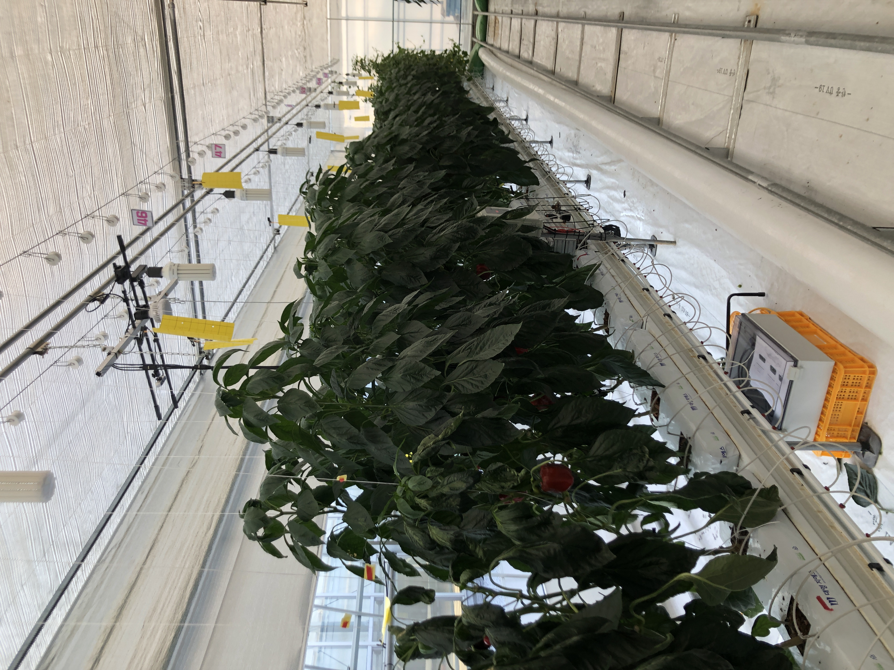

# RGB-Data-Collection
Get data from "Intel Realsense D435i", "Zed2", "PMD pico monstar" and using Relay.

</img>

## SDK

### Intel RealSense D435i (Active IR Stereo Camera)

The python wrapper for Intel RealSense SDK 2.0 provides the C++ to Python binding required to access the SDK.

The easiest way to install this library is using pip:
```
pip install pyrealsense2
```

### Zed2 (Stereo Camerea)

To start using the ZED SDK in Python, you should refer to this site:

https://www.stereolabs.com/docs/app-development/python/install/


### PMD pico monstar (ToF Camera)

To start using the Royale SDK, you should refer to this site:

https://pmdtec.com/picofamily/software/
